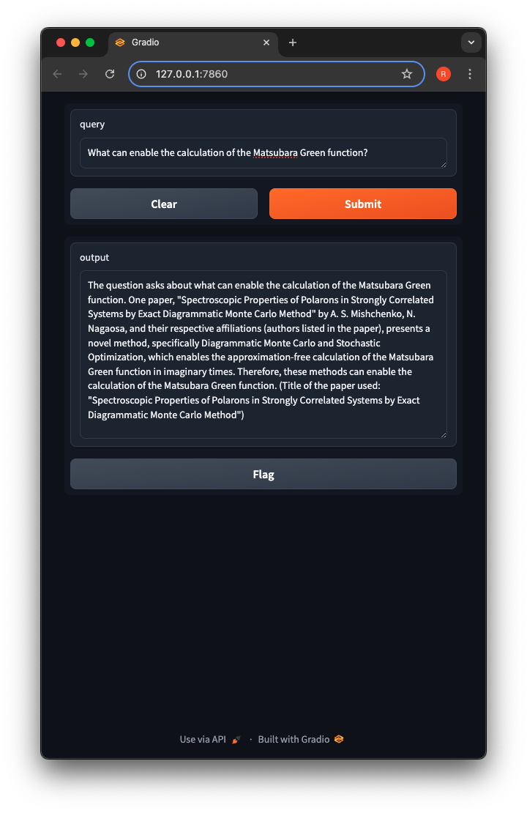

# Science Question Answering Language Model (SciQALM)
This is large language model (LLM) based on the Zephyr 7B β model. Using the Retrieval Augmented Generation (RAG), the model has been customized to provide answers to questions using information from research papers from the open-source repository arXiv. For over 100K documents, I generated embeddings using HuggingFace's sentence transformer model all-MiniLM-L6-v2 and stored them in a MongoDB database. For each user query, the top 10 documents are found using Atlas Vector Search and used as context for the SciQALM model.

# Run
To run this model, get an API token from HuggingFace. Create a file in the root directory named `api_token.txt` and paste your API token.

Next, create a MongoDB Database called `arxiv` and a collection named `embedded_abstracts`. Paste your database connection url in `mongodburl.txt`. Create a vector search mechanism in MongoDB mechanism based on the `abstract_encoded` field.

Install the necessary packages by running `pip install -r requirements.txt`

Run `process_arxiv_dataset.py` to generate embeddings for the documents in the dataset. Then, run `gradio_deploy.py` to test the model.

# Example
Using Gradio, a user interface to the model was created. Below is an example of a specific question asked and the answer given by SciQALM. It cites specific information from a scientific paper.

# Movie Recommendation Model
A similar model was created using RAG to provide answers to questions related to movies. The code for that model is available in `/movie_recommendation` and can be run in the same way as SciQALM.